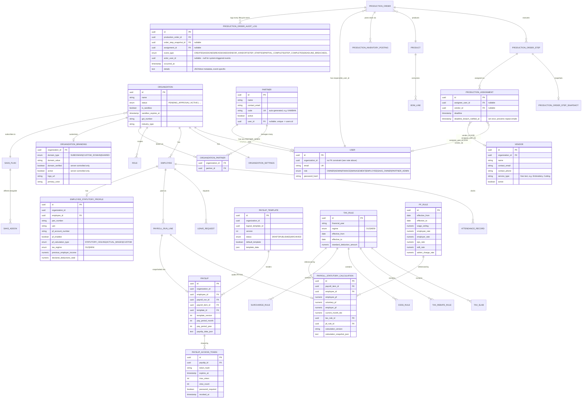

# Core Data Model & Multi-Tenancy

## Tenancy model

Factory1 uses a **single shared PostgreSQL database** with row-level tenant
isolation: nearly every domain table carries an `organization_id` column, and
every service/repository call is scoped by the caller's organization. There is
no schema-per-tenant or database-per-tenant separation.

Two categories of exception exist, both used carefully:

1. **Partner-admin users** are provisioned with a *synthetic placeholder*
   `organization_id` (a random UUID that doesn't correspond to a real org) because
   `users.organization_id` has **no foreign-key constraint** in the schema. This is
   safe only because `PARTNER_ADMIN` identity resolution goes through
   `partners.user_id`, never through `organization_id`, and both
   `OrganizationApprovalFilter` and `FeatureGateFilter` explicitly skip
   `/api/partner/**` routes. This is flagged in the codebase as a known
   architectural shortcut worth revisiting (see `docs/status/feature-status.md`).
2. **Sandbox trial organizations** are real organizations (`is_sandbox = true`)
   with a normal `organization_id`, just auto-active instead of pending approval,
   and auto-deleted by a scheduled job after expiry.

## Core entity relationships

## Notable schema/design decisions

- **`BaseEntity`**: all entities extend a common base providing `id`, audit
  timestamps, and `organizationId` where applicable. A past bug (fixed) had
  `onCreate()` unconditionally overwriting manually-assigned IDs — now it only
  sets the ID when null.
- **Production inventory postings** use a unique `(organization_id, source_type,
  source_id)` constraint as an idempotency ledger, so a retried "accept output"
  action never double-posts stock.
- **`production_orders.current_step_id` ↔ `production_order_step_snapshots`**
  has a circular FK — the sandbox cleanup job must null the FK before deleting,
  a real schema wrinkle worth simplifying eventually.
- **Flyway** governs every schema change; migrations are strictly append-only
  (never renumber/reuse a version — this caused a real deployment collision
  once, fixed by renaming `V63` → `V64`). As of writing, the schema is at
  **V71** (payroll statutory foundation in `V70`, payslip templates/delivery in
  `V71`).
- **`production_assignments` vendor-or-user XOR**: `assignee_user_id` and
  `vendor_id` are both nullable, enforced mutually exclusive by a DB check
  constraint (`ck_production_assignment_target`) plus service-level
  validation — an assignment targets exactly one of an internal `User` or a
  `Vendor`, never both/neither.
- **`production_order_audit_log` is deliberately a separate table from
  `production_events`** — `production_events` is a retryable notification
  *outbox* (delivery status/retries/idempotency for emails), not an immutable
  business audit trail; conflating the two would have made audit history
  dependent on notification delivery state.
- **Production progress is derived per step from execution rows** — the modal
  execution flow records completed/rejected quantities with `/record`; `/complete`
  can advance only after that step's execution rows account for the full planned
  quantity. Order-level completed/rejected totals are updated only from final-step
  accepted/rejected output.
- **Payroll statutory calculations are audited per payroll item** —
  `payroll_statutory_calculations` stores PF/TDS amounts, referenced rule rows,
  a calculation version, and a JSON snapshot so a payslip can explain how the
  statutory deductions were produced.
- **Payslip links never store raw tokens** — `payslip_access_tokens` stores a
  SHA-256 hash, expiry/max-view/password controls, and public access deliberately
  returns the same generic 404 for unknown, expired, revoked, exhausted, or
  password-failed links.
- **Deadline breach scheduler bug found & fixed during implementation**: the
  original scheduler called its own `@Transactional` method via `forEach`,
  which bypasses the Spring AOP proxy and silently drops the transaction. Fixed
  by extracting a separate `ProductionDeadlineBreachNotifier` bean so
  self-invocation isn't possible.
