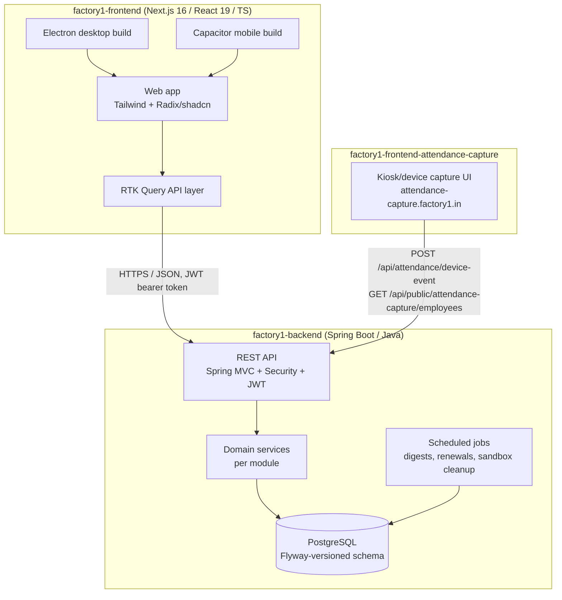

# System Overview

## What Factory1 is

Factory1 is a **multi-tenant SaaS ERP for manufacturing factories** — covering
HR/attendance/leave/payroll, inventory, production tracking, billing/accounting
(with GST + E-way bill support), and SaaS-platform concerns (pricing, partner
resellers, white-labeling, feature gating).

## Repositories & tech stack



## Deployment topology

- **Backend**: Spring Boot service, single deployable JAR, PostgreSQL as system of record, Flyway migrations gate every deploy.
- **Frontend**: Next.js app deployed as the primary web surface; the same codebase is packaged via **Capacitor** (iOS/Android) and **Electron** (desktop) for native distribution — download links are environment-configured (`NEXT_PUBLIC_FACTORY1_*_DOWNLOAD_URL`).
- **Attendance capture**: a separate, device-facing surface at `attendance-capture.factory1.in`, talking to the same backend via a small dedicated public API surface (`/api/public/attendance-capture/*`, `/api/attendance/device-event`).
- **Multi-tenancy**: single shared database, every tenant-scoped table carries an `organization_id`; enforced at the service/repository layer (no separate schema-per-tenant).
- **White-labeling**: tenants can appear under their own subdomain or custom domain; a shared base domain (`factory1.in` by default, env-configurable) hosts tenants that haven't configured a custom domain.

## Cross-cutting platform concerns

| Concern | Where it lives |
|---|---|
| Auth (JWT, OTP, roles) | `auth` module (backend), `features/auth` (frontend) |
| Multi-tenant org lifecycle (signup → pending approval → active, or sandbox trial) | `organization` module (backend) |
| Feature gating (per-plan, per-org overrides) | `feature` module (backend), `featureGating.ts` (frontend) |
| SaaS pricing catalog (plans, add-ons, offers) | `saasadmin` module (backend), `public-pricing` + `saas-admin` (frontend) |
| Partner/reseller program & white-labeling | `whitelabel` module (backend), `whitelabel` feature (frontend) |
| Sandbox/trial organizations | `organization` (sandbox fields + scheduler) + new `sandbox` signup path (backend), homepage CTA + banner (frontend) |

## Roles (`auth.enums.Role`)

```
OWNER          — organization owner, full org-level control
ADMIN          — organization admin
FINANCE        — finance/accounting-scoped access
MANAGEMENT     — production/ops management access
EMPLOYEE       — base employee access (self-service only)
SAAS_OWNER     — platform operator (SaaS admin panel)
PARTNER_ADMIN  — reseller/partner, scoped to their linked organizations only
```

See [`data-model.md`](data-model.md) for how these map to entities, and
[`module-map.md`](module-map.md) for the full backend↔frontend module inventory.
