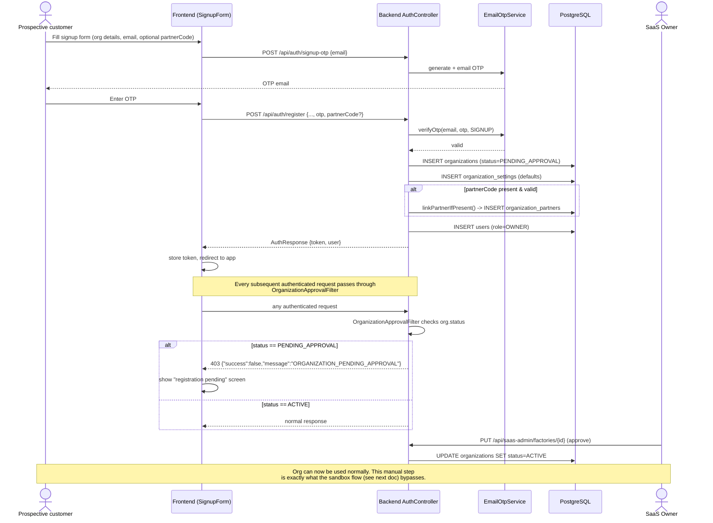
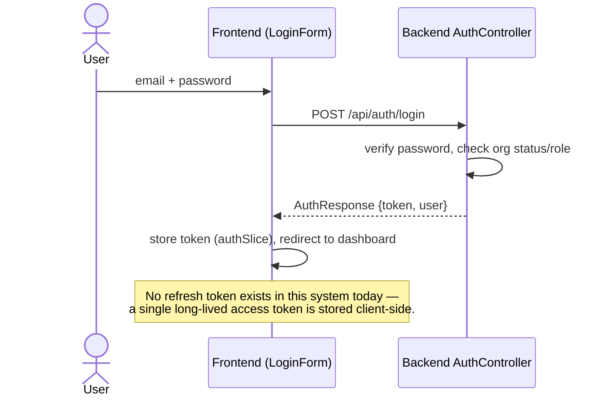

# Sequence: Auth, Signup & Approval

Covers the standard (non-sandbox) organization signup flow, login, and the
approval gate that blocks new organizations until a SaaS owner approves them.

## Standard signup → pending approval → active

## Login

