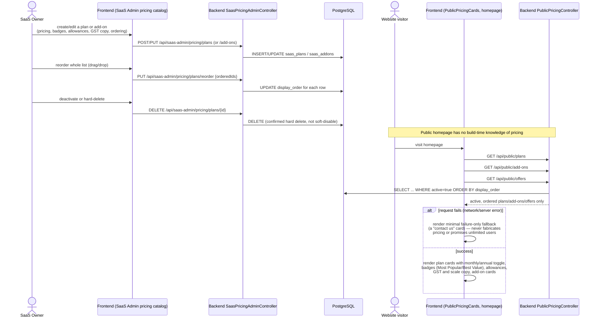

# Sequence: Configurable SaaS Pricing

Plans and add-ons are fully DB-driven (Flyway V66 seeded 5 plans + 10 add-ons)
and manageable from SaaS Admin, with the public homepage rendering live data —
no hardcoded pricing in the frontend.

## Legacy compatibility

`/api/public/plans` is kept as a **legacy-compatible alias** so any existing
integration or cached client referencing the old path keeps working while the
catalog itself is now fully configurable.
