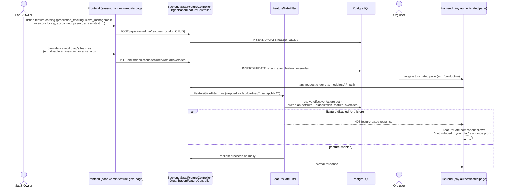

# Sequence: Feature Gating

Controls which modules/screens an organization can access based on its plan
and any SaaS-owner overrides — independent of the (frontend-only, always-off-
by-default) Tally UI flag.

## Relationship to the Tally UI flag

`NEXT_PUBLIC_ENABLE_TALLY_UI` is a **separate, frontend-only, build-time/env
flag** (default `false`) — it is not part of the backend feature-gating system.
It exists purely because the Tally-style UI mode was half-built and needed to
be hidden from all users regardless of plan, not because of any per-org
entitlement.
