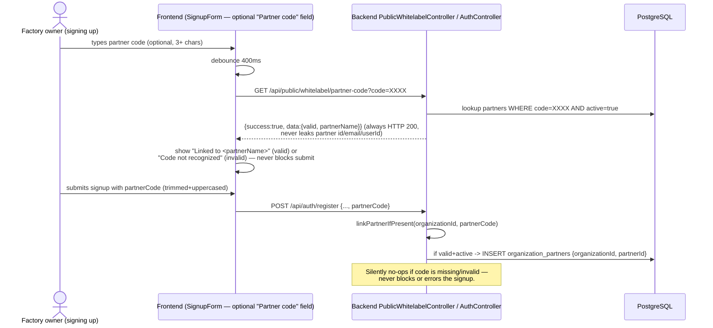
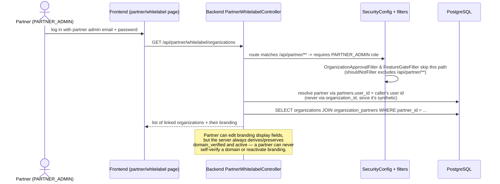

# Sequence: Partner Onboarding & Auto-Provisioning

Covers how a SaaS owner creates a reseller "partner," how that partner gets an
auto-generated login + code, how a factory links itself to that partner at
signup, and how the public code-validation endpoint works.

## Partner creation (SaaS Admin UI)

```mermaid
sequenceDiagram
    actor SA as SaaS Owner
    participant FE as Frontend (SaasWhitelabelPage — Add Partner dialog)
    participant API as Backend WhitelabelAdminServiceImpl
    participant DB as PostgreSQL
    participant MAIL as EmailService (best-effort)

    SA->>FE: enter partner name + contact email only
    FE->>API: POST /api/saas-admin/whitelabel/partners {name, contactEmail}
    API->>API: derive unique code from name<br/>(first3+first3 of two words, e.g. "Kamal Bansal" -> "KAMBAN";<br/>collision -> counter suffix "KAMBAN2"; single word -> first6;<br/>random suffix only for fully-symbolic names)
    API->>DB: INSERT partners {name, contactEmail, code, active=true}
    API->>API: generate SecureRandom temp password
    API->>DB: INSERT users {role=PARTNER_ADMIN, organization_id=<synthetic UUID>,<br/>password=encode(tempPassword)}
    API->>DB: UPDATE partners SET user_id = new user's id
    API->>MAIL: send invite email (name, code, temp password, login instructions)
    Note over MAIL: Reuses existing forgot-password OTP flow<br/>for the partner's first real password reset —<br/>no new activation-token mechanism was built.
    API-->>FE: {partner, generatedCode}
    FE->>FE: show copyable success dialog with code + admin login email
```

## Factory signup with a partner code



## Partner-scoped restricted access


