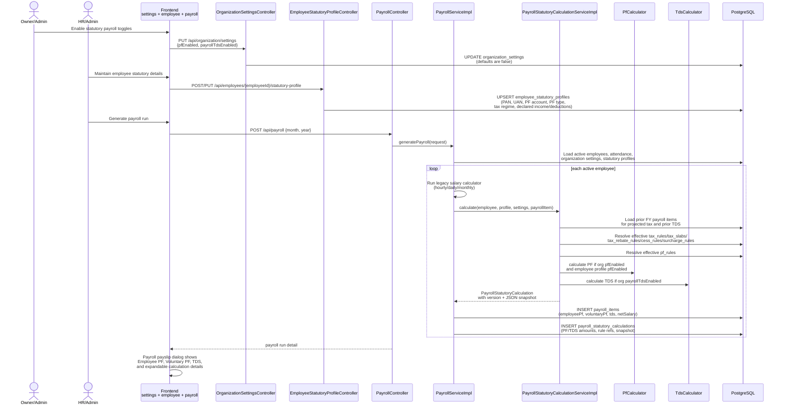
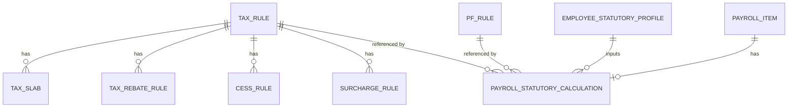
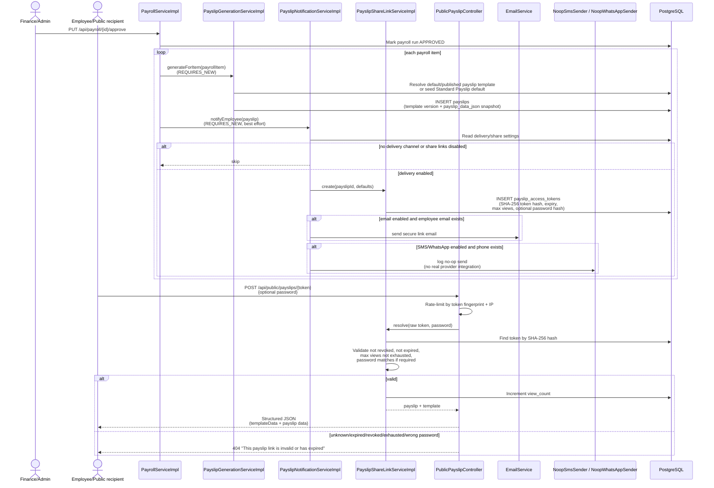

# Sequence: India Payroll Statutory Engine & Payslip Sharing

This covers the current backend statutory payroll and payslip modules plus the
frontend surfaces that exist in the current main checkout. PF/TDS is opt-in per
organization and employee; payslip templates/share links are implemented in the
backend, while the current frontend main branch exposes statutory settings,
employee statutory profiles, and payroll payslip statutory breakdowns but does
not yet include a payslip-template admin panel, "Share securely" action, or
unauthenticated `/payslip/[token]` viewer route.

## PF/TDS settings, employee profile, and payroll generation

## Statutory rule and audit tables

The statutory audit row stores the numbers shown in the payslip breakdown:
`pfWages`, `employeePf`, `voluntaryPf`, `employerPf`, `employerEpf`, `eps`,
`edli`, `adminCharge`, `projectedAnnualIncome`, `taxableIncome`, `baseTax`,
`annualTax`, `taxAlreadyDeducted`, `currentMonthTds`, `taxRuleId`, `pfRuleId`,
`calculationVersion`, and `calculationSnapshotJson`.

## Payslip generation, secure share link, and public access

## Default template shape

`PayslipTemplateDefaults.DEFAULT_TEMPLATE_JSON` defines the built-in template
seeded for an organization when no template exists:

| Section | Shape |
|---|---|
| `header` | `showLogo`, `companyName`, `companyAddress` |
| `employeeInfo` | `fields` array (`employee.name`, `employee.employeeCode`, `employee.designation`, `employee.department`, `payPeriod`) |
| `earnings` | rows for `basic`, `grossSalary`, `overtimeAmount` |
| `deductions` | rows for `employeePf`, `voluntaryPf`, `tds` |
| `employerContributions` | rows for `employerPf`, `eps`, `edli`, `adminCharge` |
| `netPay` | `field: netSalary`, `amountInWords: true` |
| `signatureBlock` | `showSignature`, `text` |

Supported placeholders include employee identity fields, organization name and
address, pay period, earnings, statutory deductions, employer PF components, and
net salary. The backend returns these as structured JSON snapshots; it does not
generate PDF bytes.
