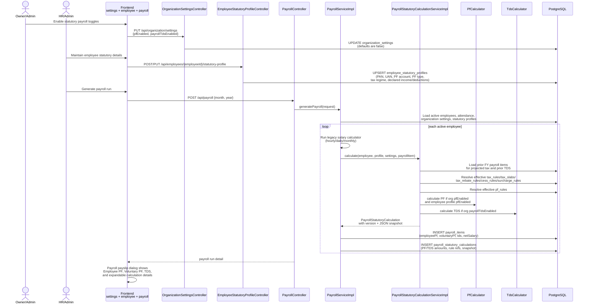
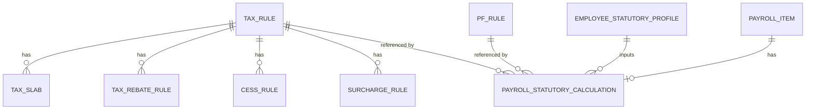
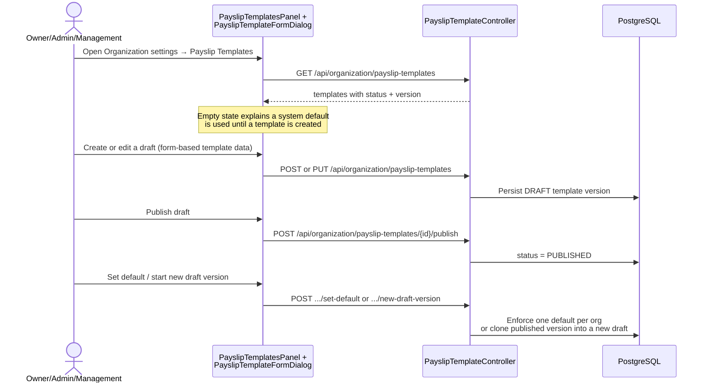
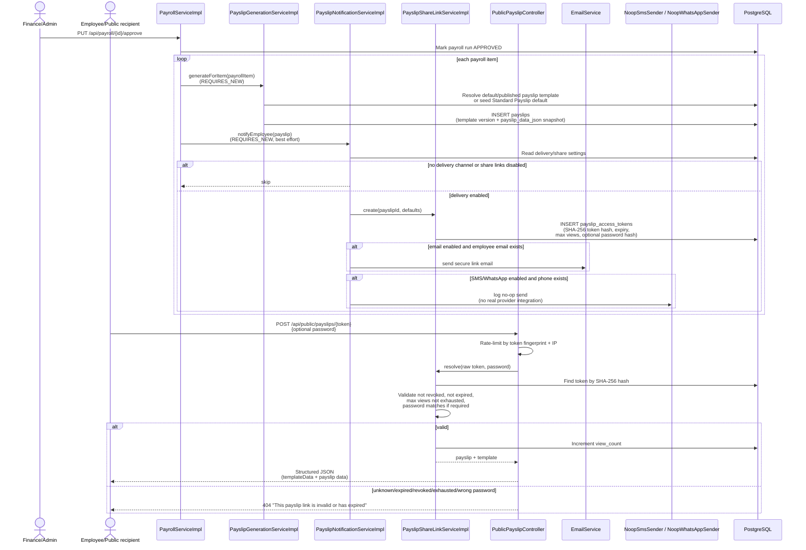
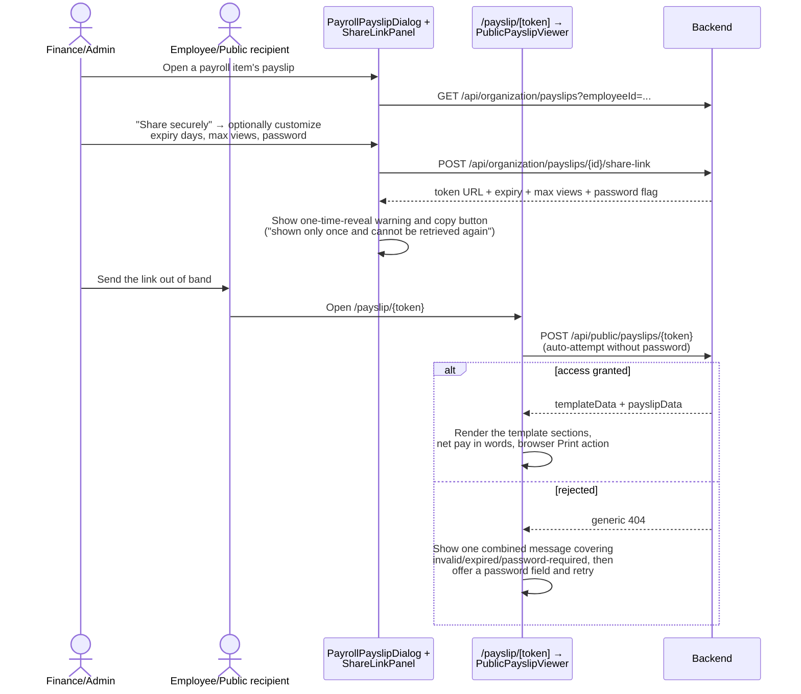

# Sequence: India Payroll Statutory Engine & Payslip Sharing

This covers the current backend statutory payroll and payslip modules together
with the frontend surfaces that drive them. PF/TDS is opt-in per organization and
per employee. Payslip templates, secure share links, and public token viewing are
shipped end to end: organization settings host the templates admin panel and
delivery/link policy, the payroll payslip dialog exposes "Share securely", and
`/payslip/[token]` renders the unauthenticated viewer.

## PF/TDS settings, employee profile, and payroll generation

## Statutory rule and audit tables

The statutory audit row stores the numbers shown in the payslip breakdown:
`pfWages`, `employeePf`, `voluntaryPf`, `employerPf`, `employerEpf`, `eps`,
`edli`, `adminCharge`, `projectedAnnualIncome`, `taxableIncome`, `baseTax`,
`annualTax`, `taxAlreadyDeducted`, `currentMonthTds`, `taxRuleId`, `pfRuleId`,
`calculationVersion`, and `calculationSnapshotJson`.

## Template administration (organization settings)

## Payslip generation, secure share link, and public access

## Manual sharing and public viewing in the UI

Because the backend deliberately returns the same generic 404 for every failure
mode, the viewer cannot distinguish "wrong password" from "expired" or "unknown
token" — so it intentionally shows a single combined message and offers a
password retry rather than guessing the cause.

## Default template shape

`PayslipTemplateDefaults.DEFAULT_TEMPLATE_JSON` defines the built-in template
seeded for an organization when no template exists:

| Section | Shape |
|---|---|
| `header` | `showLogo`, `companyName`, `companyAddress` |
| `employeeInfo` | `fields` array (`employee.name`, `employee.employeeCode`, `employee.designation`, `employee.department`, `payPeriod`) |
| `earnings` | rows for `basic`, `grossSalary`, `overtimeAmount` |
| `deductions` | rows for `employeePf`, `voluntaryPf`, `tds` |
| `employerContributions` | rows for `employerPf`, `eps`, `edli`, `adminCharge` |
| `netPay` | `field: netSalary`, `amountInWords: true` |
| `signatureBlock` | `showSignature`, `text` |

Supported placeholders include employee identity fields, organization name and
address, pay period, earnings, statutory deductions, employer PF components, and
net salary. The backend returns these as structured JSON snapshots; it does not
generate PDF bytes.
