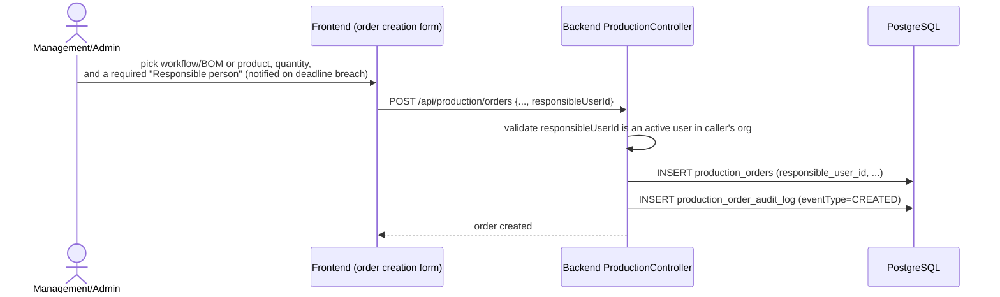
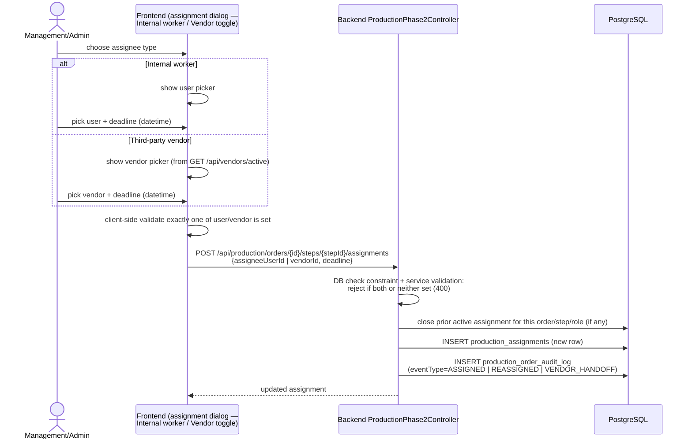
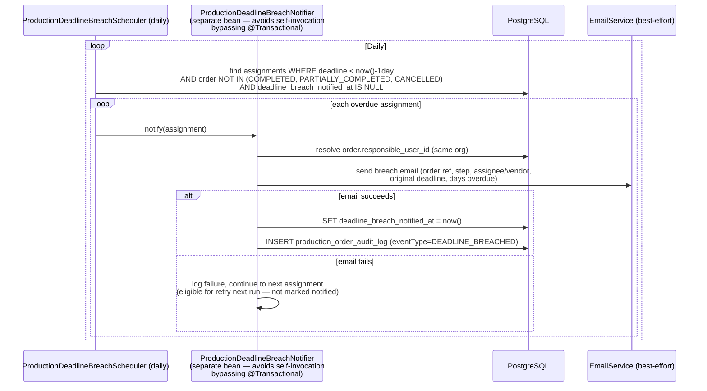
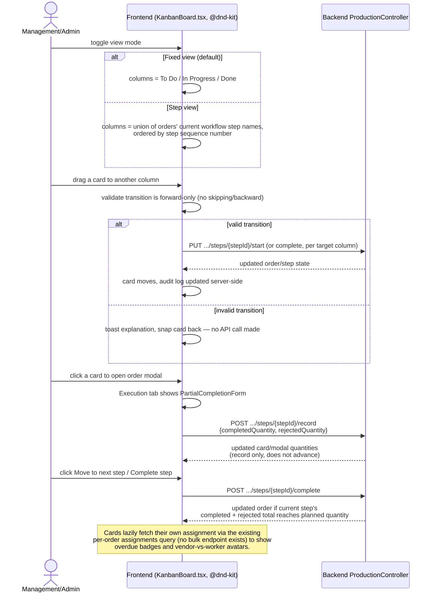
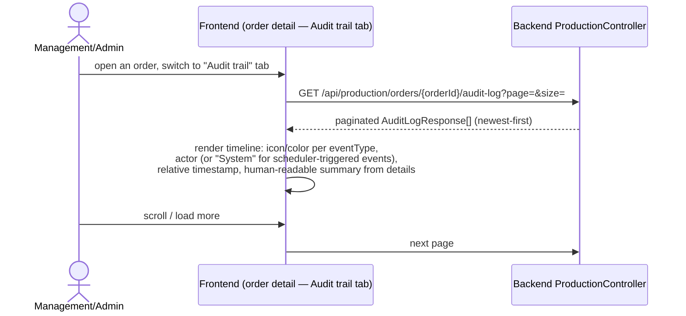
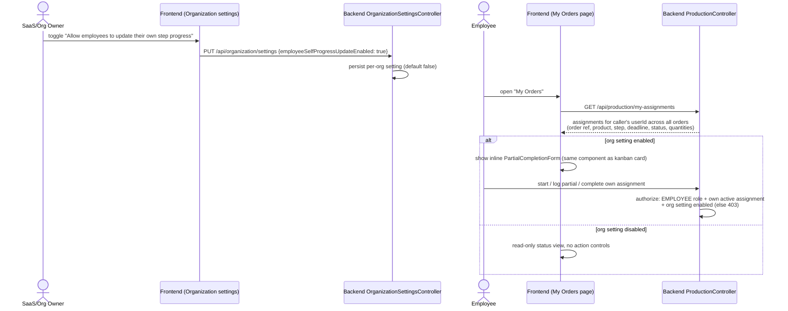

# Sequence: Production Kanban, Vendor Outsourcing, Deadlines & Audit Trail

Covers the production-tracking overhaul around the current modal execution
lifecycle: vendor outsourcing, per-step deadlines with breach notification, the
full audit trail, board/list Kanban, and employee self-service "My Orders" view.

## Order creation with a responsible person

## Assigning a step to an internal worker OR a vendor

## Deadline breach detection & notification

Note: no manager/reporting-line concept exists in `User`/`Employee` today — the
email goes only to the order's `responsibleUserId`. Flagged as a known gap if
per-assignee-manager escalation is needed later.

## Jira-style kanban board (drag-and-drop)

Layout note: the current production orders tab supports **board/list** views,
and board columns use a wrapping grid so the workspace can stay full-width
without the old always-horizontal board layout.

## Audit trail view

## Employee "My Orders" self-service view

