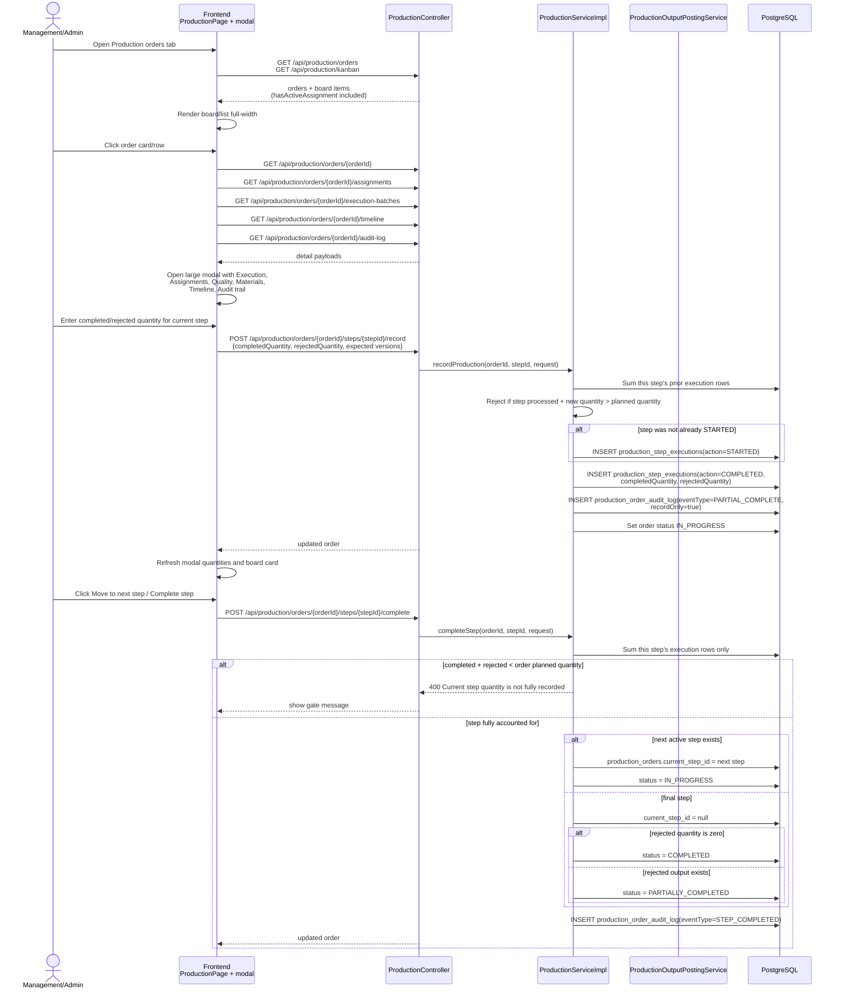
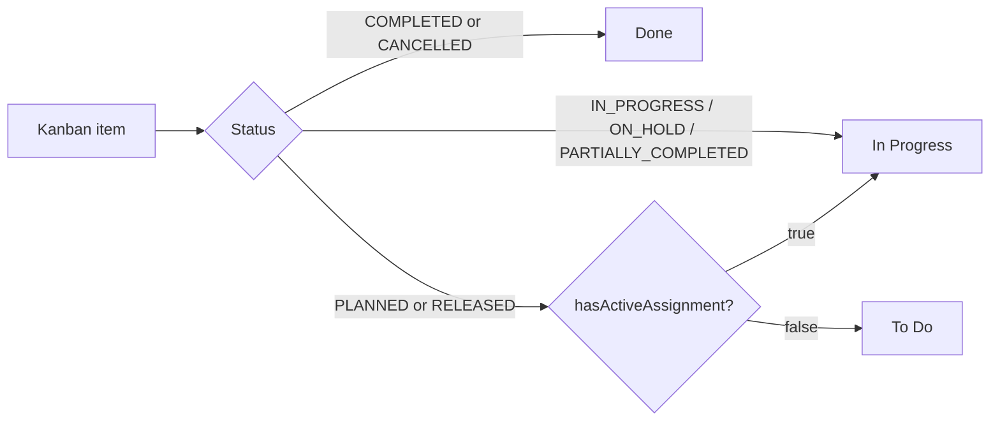

# Sequence: Production Order Modal Execution Lifecycle

This reflects the current production-order UX and backend lifecycle: the primary
workspace is ordered as **Production orders → Workflow templates → BOM
definitions → Workstations → Analytics**. Selecting an order opens a large modal
with **Execution**, **Assignments**, **Quality**, **Materials**, **Timeline**, and
**Audit trail** sections.

The current execution model is record-first. Users no longer need visible
Start/Pause controls to make normal progress: the first `/record` call implicitly
starts the step when needed, `/record` only accumulates completed/rejected
quantities for that step, and `/complete` advances only once that step has
processed the order's planned quantity.

> See also [`production-kanban-vendor-overhaul.md`](production-kanban-vendor-overhaul.md)
> for vendor/internal assignment, deadlines, employee self-service, and Kanban
> board behavior built around this lifecycle.

## Modal-based execution and step advancement



## Final-step inventory posting

```mermaid
sequenceDiagram
    participant SVC as ProductionServiceImpl
    participant POST as ProductionOutputPostingService
    participant DB as PostgreSQL

    Note over SVC: Only final-step accepted output<br/>becomes finished stock.
    SVC->>POST: postFinalStepOutput(order, step, completed,<br/>sourceType=STEP_EXECUTION, sourceId=executionId)
    POST->>DB: Check production_inventory_postings unique<br/>(organization_id, source_type, source_id)
    alt already posted
        POST-->>SVC: no-op idempotent replay
    else not posted
        POST->>DB: Read published BOM lines for order product
        POST->>DB: Atomically decrement raw-material stock<br/>using BOM quantity + waste percentage
        alt any material insufficient
            POST-->>SVC: throw; transaction rolls back
        else all material available
            POST->>DB: Increment finished-good stock by accepted quantity
            POST->>DB: INSERT production_inventory_postings ledger row
            POST-->>SVC: posted
        end
    end
```

## Kanban placement rule



The important backend correction behind the UX is that progress is now derived
from execution rows for the **specific step being viewed or advanced**. The old
order-level-only accumulation was too coarse: it could make a later modal action
look complete because the order had output elsewhere, even when the current
step's own completed + rejected rows did not yet account for the planned
quantity.
