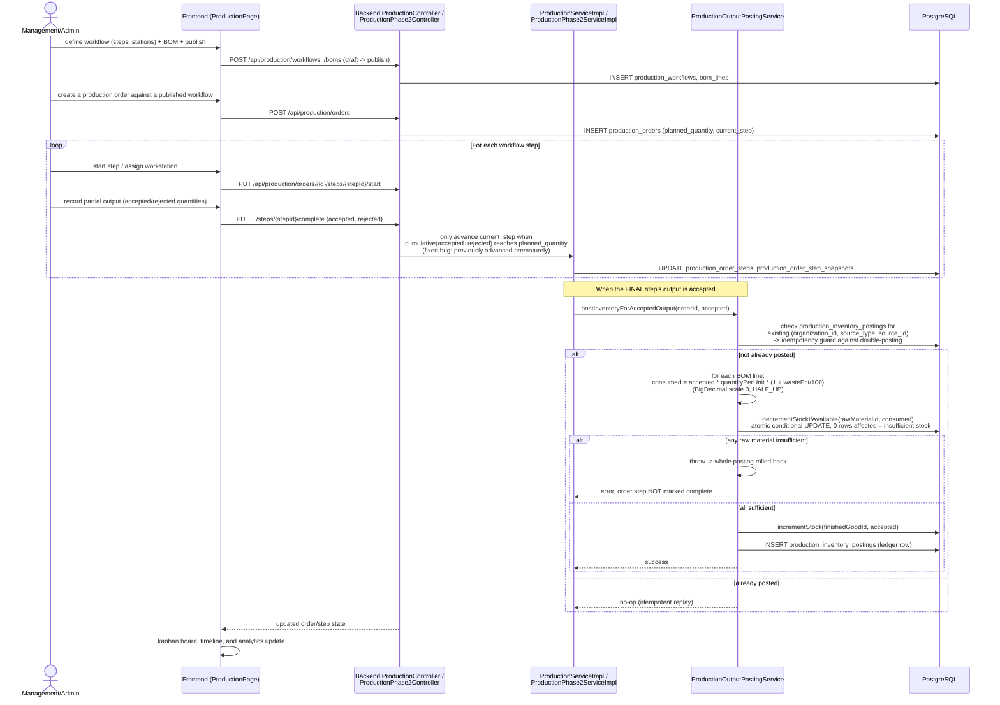

# Sequence: Production Order Lifecycle & Automatic Inventory Posting

The most mature domain module. Covers workflow definition, order execution
step-by-step, and the automatic stock posting that happens when a final step's
output is accepted.

