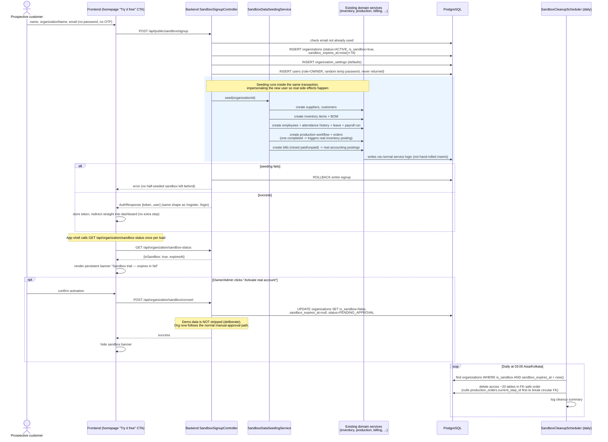

# Sequence: Sandbox Trial Signup

The fast, no-approval path added to let prospects try Factory1 instantly. Contrast
with [`auth-and-signup.md`](auth-and-signup.md) — no OTP, no manual approval, and
the org is pre-seeded with realistic demo data across every module.

## Deliberate scope decisions (from the implementing session)

- No captcha/rate-limiting on the public signup endpoint yet — flagged as a follow-up.
- `ORG_ADMIN` maps to the existing `Role.OWNER` — no separate role was introduced.
- Seeding reuses **real domain services**, not raw inserts, so all side effects
  (stock decrements, ledger postings) are realistic and consistent with production behavior.
- Converting to a real account does not delete the seeded demo data.
