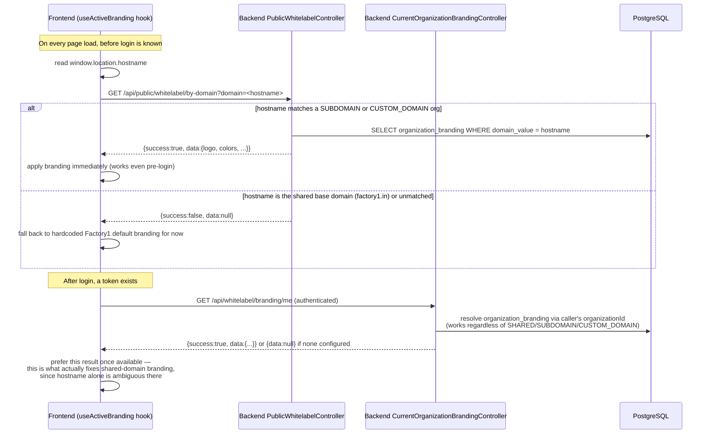
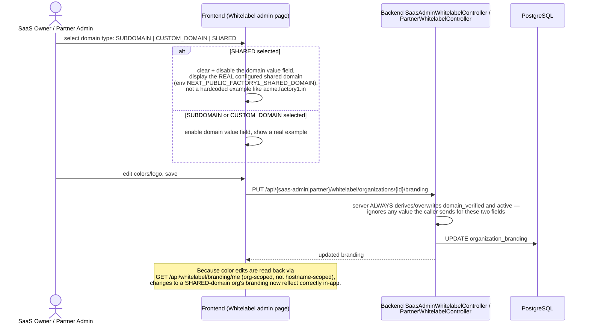

# Sequence: White-Label Branding Resolution

Two independent resolution paths exist because a hostname alone cannot identify
a tenant on a **shared** domain (many orgs share `factory1.in`).

## Domain type UX (SaaS/Partner admin editing branding)

